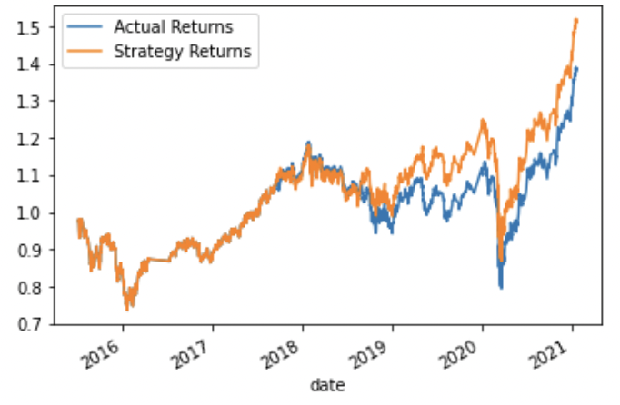
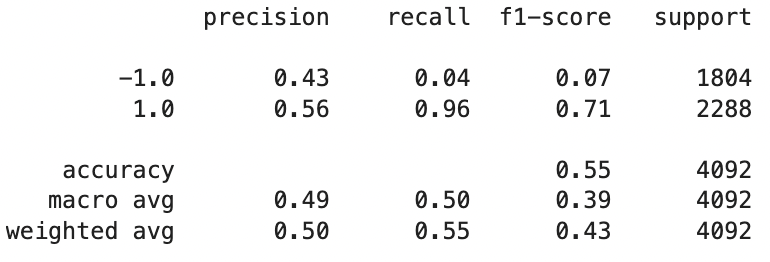
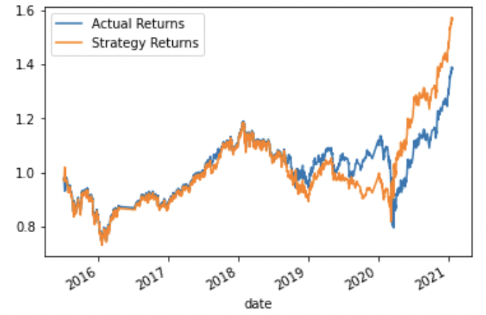
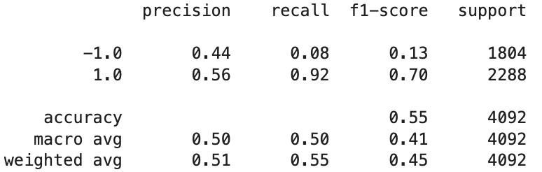

# 14_Algorithmic_Trading

### This project aims to improve the existing algorithmic trading system with machine learning algorithms that can adapt to new data. This is done by establishing the baseline performance, tuning the baseline trading algorithm, and then evaluating a new machine learning classifier to ultimately create an evaluation report of the performances.

---

## Technologies

This project leverages python 3.9 and Jupyter lab notebook was used to run all analysis.

---

## Installations

Before running the application first import the following libraries and dependencies.

```python
import pandas as pd
import numpy as np
from pathlib import Path
import hvplot.pandas
import matplotlib.pyplot as plt
from sklearn import svm
from sklearn.preprocessing import StandardScaler
from pandas.tseries.offsets import DateOffset
from sklearn.metrics import classification_report

```

---

## Baseline Performance

With the given codes and historic data provided in the OHLCV dataset, trading signals using the short- (4-day) and long-window (100-day) SMA values were generated. Then, using the SVC classifier model, we fit the training data to make predictions based on the testing data.

Below is a summary of the results of the cumulative return plot that demonstrates the actual vs. strategy returns and the classification report with the SVC model:





---

## New Machine Learning Classifier

A new machine learning classifier, [AdaBoost](https://scikit-learn.org/stable/modules/ensemble.html#adaboost), was used as the alternative model:

```python
from sklearn.ensemble import AdaBoostClassifier
```

Below is a summary of the results with AdaBoost:





---

## Conclusion

Using the same dataset and parameters, both models had the same accuracy of 0.55 and also the exact same precision for both predictions of -1 class and the 1 class.

- Both models had very similar precision scores 0.43 and 0.56 for SVC and 0.44 and 0.56 for AdaBoost.

* Both models had a higher recall (0.96 SVC, 0.92 AdaBoost) for the 1 class, therefore, both models are better at predicting the 1 class (buy) than the -1 class (sell).

* The recall for -1 was 0.04 for the SVC model and 0.08 for the AdaBoost model.

* The F1 score for the -1 class is much higher in the AdaBoost than the SVC model but for the 1 class, AdaBoost is slightly lower (0.70) than the SVC model (0.71) for the 1 class.

When observing their plots of the actual vs. strategy returns visually, both models did well up until mid 2018. The AdaBoost classifier began to perform in the opposite direction from the beginning of 2019 until tail end of that year while the SVC model remained slightly above the actual returns throughout the rest of the years. AdaBoost model did not come back on track until the beginning of the pandemic; it rose and stayed slightly above the actual returns.

Since both have the same accuracy scores, it is difficult to say which model is better than the other. However, the original model seemed to be more accurate from what the plots demonstrated. Perhaps the suggestion is to continue to identify a different machine learning model to make better predictioins.
